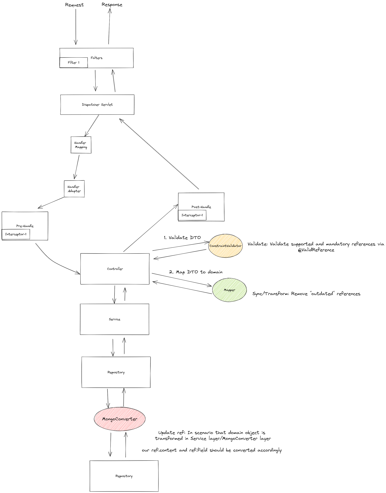

# Spring Boot MVC Data Source Map

This project explore ways to design a model (schema) where it allows to map / attribute each field + content to a
particular data source.

- [Spring Boot MVC Data Source Map](#spring-boot-mvc-data-source-map)
    - [Overview](#overview)
    - [Schema](#schema)
    - [Concepts](#concepts)
    - [Biz Logic](#biz-logic)
        - [Sync](#sync)
        - [Validate](#validate)
        - [Summary](#summary)
    - [Experimentation](#experimentation)
        - [Logic](#logic)
        - [JsonPath Implementation](#jsonpath-implementation)
            - [Details](#details)
            - [Further improvements](#further-improvements)
    - [Run Project](#run-project)
        - [Mongo Express](#mongo-express)

## Overview

This POC aims to investigate how and where we can (1) validate and (2) sync a document's contents and its references.

- **Content** refers to all the fields
- **References** are the source of where that piece of content was obtained.

## Schema

This is our schema of choice:

```json
{
  "company": "string",
  "appointment": {
    "position": "string",
    "rank": "string",
    "references": [
      {
        "field": "string",
        "content": "string",
        "source": [
          {
            "dateObtained": "string",
            "referenceType": "enum",
            "comments": "string"
          }
        ]
      }
    ]
  },
  "duration": "string",
  "lastDrawnSalary": "string",
  "skills": [
    "string"
  ],
  "certs": [
    {
      "name": "string",
      "issuedBy": "string",
      "references": [
        {
          "field": "string",
          "content": "string",
          "source": [
            {
              "dateObtained": "string",
              "referenceType": "enum",
              "comments": "string"
            }
          ]
        }
      ]
    }
  ],
  "references": [
    {
      "field": "string",
      "content": "string",
      "source": [
        {
          "dateObtained": "string",
          "referenceType": "enum",
          "comments": "string"
        }
      ]
    }
  ]
}
```

It contains fields of the following types:

1. Single-field (`company`, `duration` , `lastDrawnSalary` )
2. Single-object (`appointment`) - contains `Reference`
3. Multi-field (`skills`)
4. Multi-object (`certs`) - contains `Reference`

To support a one-to-many relationship of field-to-reference:

- Each reference contains a list of source.

## Concepts

The explanations will be made with reference to this sample document:

```json
{
  "id": "636dfc781bdbf02672ce98d3",
  "company": "Michelin Star Restaurant",
  "appointment": {
    "position": "Chef B",
    "rank": "Professional A",
    "references": [
      {
        "field": "rank",
        "content": "Professional A",
        "source": [
          {
            "dateObtained": "2022-11-11T12:19:54.52",
            "referenceType": "LINKED_IN",
            "comment": "Obtained via LinkedIn learning"
          }
        ]
      }
    ]
  },
  "duration": "1Y",
  "lastDrawnSalary": "4K",
  "skills": [
    "Cooking",
    "Slicing"
  ],
  "certs": [
    {
      "name": "Slicing",
      "issuedBy": "Cooking School A",
      "references": [
        {
          "field": "issuedBy",
          "content": "Cooking School A",
          "source": [
            {
              "dateObtained": "2022-11-11T12:19:54.52",
              "referenceType": "LINKED_IN",
              "comment": "Obtained via LinkedIn learning"
            }
          ]
        }
      ]
    },
    {
      "name": "Cooking",
      "issuedBy": "Cooking School B",
      "references": [
        {
          "field": "name",
          "content": "Cooking",
          "source": [
            {
              "dateObtained": "2022-11-11T12:19:54.52",
              "referenceType": "LINKED_IN",
              "comment": "Obtained via LinkedIn learning"
            }
          ]
        }
      ]
    }
  ],
  "references": [
    {
      "field": "company",
      "content": "Michelin Star Restaurant",
      "source": [
        {
          "dateObtained": "2022-11-11T12:19:54.52",
          "referenceType": "LINKED_IN",
          "comment": "Obtained via LinkNedIn learning"
        }
      ]
    },
    {
      "field": "skills",
      "content": "Slicing",
      "source": [
        {
          "dateObtained": "2022-11-11T12:19:54.52",
          "referenceType": "LINKED_IN",
          "comment": "Obtained via LinkedIn learning"
        }
      ]
    }
  ]
}
```

- Single-object and multi-object (List of objects) are seen as embedded documents, hence they can contain their
  own `references`.
- As such, the sample document contains the following references:
    - `reference` in the root document: tagging to `company`
    - `reference` in the root document: tagging to `skills`
    - `reference` in `appointment`: tagging to `rank`
    - `reference` in `certs`: tagging to `name` or `issuedBy`

## Biz Logic

These are the following requirements

1. Validation: mandatory references present and non-supported references prohibited
2. Sync-reference-to-content: remove "outdated" references
3. Update-reference-by-domain: TODO

### Summary



#### Sync

Syncing is referred to removing outdated references, based on the current document.

##### Implementation Details - How?

There are some ways we can match the content with the references that came with it:

1. Reflection API:
    - Reflection allows an executing Java program to examine or "introspect" upon itself.
    - Potential approach: In this case, we can get the fields based on the `reference.field` during run-time
    - Cons: Since reflection allows code to perform operations that would be illegal in non-reflective code, such as
      accessing private fields and methods, the use of reflection can result in unexpected side-effects.
2. JSONPath (Current Implementation)
    - Convert POJO to json String representation.
    - After converting `reference.field` to JsonPath's syntax, we are able to parse the JSON string and obtain
      the `List<String>`/`String` representation which should match `reference.content`
3. BeanWrapper

##### Implementation Details - Where?

- **DTO-to-domain conversion (using Mapstruct)**
- To abstract out the logic of syncing reference with content, and mapping our domain objects, we can do it when the DTO
  is converted to POJO
- Mapstruct supports the following:
    - Mapping between source and target objects
    - Callback functions before/after mapping
    - Support with lombok
    - Support for generic mapping

1. Common "Mapper" `ReferenceResolver` which is used by all Mappers (e.g., `CareerHistoryMapper`, `EmployeeMapper`)
    - Each mapper invokes the `ReferenceResolver` using the annotation: `@Mapper(uses = {ReferenceResolver.class})`

2. Using `@AfterMapping`, we can also pass in the `@MappingTarget` (i.e., object builder), such that we can run our sync
   processing generically and recursively:

  ``` java
    @Component
    @Slf4j
    public class ReferenceResolver {
      @Autowired
      ObjectMapper objectMapper;

      @AfterMapping
      public <T extends ReferencesDTO, S extends References.ReferencesBuilder<?, ?>> void syncReference(T baseDTO, @MappingTarget S builder) {
        // insert sync logic
        (builder).references(inSyncReference);
      }
    }
  ```

- i.e., Any DTO that extends `ReferenceDTO` and is annotated with `@SuperBuilder` will invoke this method, build the
  synced reference, before the main mapping method builds the POJO and returns it.

#### Validate

- TODO

##### Implementation Details - Where?

- Using `ConstraintValidator` and custom interface `@ValidReference`

### Update ref

- TODO

## Experimentation

We aim for our implementation to be:

1. Generic - It should tailor to:
    - All data types, not just `String`
    - All schemas
2. Ease of use - Since `Reference` should be applied on almost every resource, we should:
    - Reduce code-duplication
    - Abstract it appropriately
3. Intuitive
4. Sustainable
5. (Stretch) Efficient
6. (Stretch) Easy interpretation by clients

#### Further improvements

1. Consider the best place to handle:
    - Conversion: Mapper abstract class during conversion
    - Further upstream: HandlerInterceptor, do it before deserialising?
    - Cross-cut concern: interceptor via AOP

2. Any way of handling type-safety?

## Run Project

Start `MongoDB`

```sh
cd ./.docker
docker-compose up -d
```

Run

```sh
./mvnw spring-boot:run
```

### Mongo Express

`docker compose` script will setup `mongo express` service which is a web-based UI. It is accessible
via `http://localhost:8081`

---

Project is created
via [start.spring.io](https://start.spring.io/#!type=maven-project&language=java&platformVersion=2.7.5&packaging=jar&jvmVersion=17&groupId=com.bwgjoseph&artifactId=spring-mvc-data-source-map&name=spring-mvc-data-source-map&description=Spring%20Boot%20MVC%20Data%20Source%20Map&packageName=com.bwgjoseph.spring-mvc-data-source-map&dependencies=devtools,lombok,configuration-processor,web,data-mongodb,validation)
